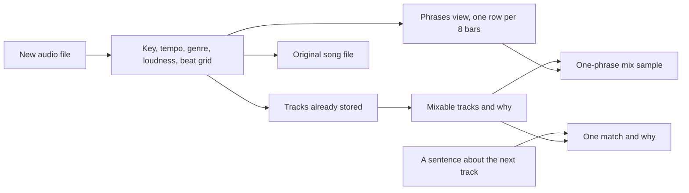

# Deejay spec

Deejay is a catalog of songs for a DJ. You add tracks over time. Each track keeps its own audio file and the DJ features computed from it. When a new track arrives, the app names which tracks already in the catalog are mixable with it, and why. For any mixable pair, you can render one short sample of the handoff and play it. The original song always stays its own file.

[`notes`](../notes) is the DJ knowledge this app follows. This spec restates those rules in plain language. Follow the spec, not a different theory of DJing. Genre is the one rule that is not in the notes. It is set here.

## What goes in

You upload an audio file. A title is optional. If you leave it off, the title is the file name. You do not type BPM, key, genre, or a brief. Every feature is a computed column.

## The grid

From the notes: a beat is the kick. A bar is 4 beats. A phrase is 8 or 16 bars. A section is 64 beats (16 bars).

This grid follows beats, not phrases. Librosa finds beats. It does not find the downbeat, which is where bar 1 starts. So the app counts beats in bars of 4, phrases of 32, and sections of 64 from the first beat it detects, and that first beat may not be bar 1. Phrase alignment that follows the song's real structure is out of this version.

Leading and trailing silence are trimmed before the grid is counted, so a fade-out or a silent tail is not treated as part of the last phrase.

## Features stored on every track

All of these are computed columns, filled once on insert:

- Duration, from the audio metadata.
- Audible start and end, in seconds, after silence is trimmed.
- BPM as estimated, a 5 BPM bucket, and the beat times.
- Camelot key, runner-up key, key score, key margin, and whether the key is uncertain.
- Genre, runner-up genre, genre score, genre family, and whether the genre is uncertain.
- Loudness, a stand-in for the notes' "emotional reaction," so you can see which tunes sit hotter. It is shown. It does not decide whether a pair is mixable.
- Phrase length in seconds, which is 32 beats (8 bars) at this track's BPM, and the number of full phrases. A track with fewer than 32 beats is stored and is mixable with nobody, because the overlap needs a full phrase on both sides.

The app does not label verse, chorus, or bridge inside a file.

### Tempo

BPM is stored as librosa estimates it. It is never halved or doubled into a range, so a 174 BPM track never matches an 87 BPM one. Each track also gets a 5 BPM bucket, such as `170–174`.

Beat trackers sometimes lock onto half or double the true tempo. The stored BPM shows that. The app does not try to correct it.

### Key

Librosa has no key detector, so the key UDF is written for this app. It averages chroma over the harmonic part of the track and scores all 24 major and minor keys against the Krumhansl–Schmuckler key profiles. The best score becomes a Camelot code through two fixed tables, each starting from C:

- Major (`B`): `8, 3, 10, 5, 12, 7, 2, 9, 4, 11, 6, 1`
- Minor (`A`): `5, 12, 7, 2, 9, 4, 11, 6, 1, 8, 3, 10`

The UDF takes an `Audio` and returns four fields:

- `camelot`, the best key.
- `key_runner_up`, the second-best key.
- `key_score`, the correlation of the best key.
- `key_margin`, the best score minus the runner-up's.

The key is **uncertain** when the margin is under 0.05 and the runner-up is not on the same Camelot T as the best key. The 0.05 is a starting value. Phase 2 may tune it. When this kind of detector misses, the runner-up is usually the relative key (`8A` and `8B`) or a fifth away (`8A` and `9A`). Both are on the same T, so the miss still mixes, and that track is not uncertain.

Essentia's `KeyExtractor` with the `edma` profile can replace this UDF later behind the same signature. It is not in this version. It is AGPL-3.0, which matters for a hosted service, and its wheels would have to resolve against Pixeltable 0.7.14.

### Genre

Pixeltable's Hugging Face functions have no audio classifier, so the genre UDF is written for this app. It runs zero-shot classification with `laion/larger_clap_music`, a CLAP model trained on music, through the `transformers` zero-shot audio classification pipeline. It scores three 10-second windows from the middle of the audible audio against a fixed list of genres, then averages the scores.

The UDF returns four fields:

- `genre`, the best genre.
- `genre_runner_up`, the second-best genre.
- `genre_score`, the averaged score of the best genre.
- `genre_family`, the family the best genre belongs to.

The genre list and families live in one table in the project module, so you can edit them:

- **House:** house, deep house, tech house, disco.
- **Techno:** techno, trance.
- **Bass:** drum and bass, dubstep, UK garage.
- **Urban:** hip hop, R&B, afrobeats, reggaeton.
- **Pop:** pop.
- **Chill:** ambient, downtempo.

The genre is **uncertain** when the best score is under 0.4 and the runner-up is in a different family. The 0.4 is a starting value. Phase 2 may tune it.

`transformers` and `torch` make the hosted image larger. The first run downloads the model.

## Phrases view

A view, `phrases`, splits each track into one row per phrase. It is the same grid the rest of the app counts on, so you can see the shape of a song and where a mix can start.

The built-in `audio_splitter` cuts by a fixed number of seconds starting at 0:00. A phrase is a fixed number of beats, and its length in seconds depends on the track's BPM. So the view uses a custom iterator, `phrase_splitter`, written with `@pxt.iterator` in the project module. It takes the track's audio, its beat times, and its audible start and end. It cuts every 32 beats (8 bars), starting at the first detected beat. A trailing stretch shorter than 32 beats is dropped.

Each phrase row has:

- `phrase_index`, counting from 0.
- `section_index`, which is `phrase_index` divided by 2 and rounded down. A section is 64 beats, which is two phrases.
- `start` and `end`, in seconds.
- `phrase_audio`, the audio of that phrase. You can play it.
- Loudness, and low-end energy below about 150 Hz (the kick and bass).
- `energy_change`, this phrase's loudness minus the previous phrase's, so a build or a drop shows as a jump. The first phrase has none.

The view does not label a phrase as verse, chorus, build, or drop. The energy columns are there so you can see where those likely are.

The same caveat as the grid applies. Phrases are counted from the first detected beat, which may not be bar 1, so a phrase boundary can sit a few beats off the song's real structure.

The preview in `samples` uses the same phrase boundaries: the last full phrase of the first track and the first full phrase of the second. It calls the same function that computes the boundaries, so the sample and the view always agree.

A track's phrase count comes from this grid. A track with no full phrase has no rows in the view, and it is mixable with nobody.

Fallback, if Pixeltable 0.7.14 does not accept a computed column such as the beat times as an iterator input: `phrase_splitter` takes only the audio, and it computes the beats itself with the same tempo function the `tracks` table uses. Phase 1 names the version it will try first. Phase 2 reports whether it fell back.

In the dashboard, open `deejay`, then `phrases`, and play `phrase_audio`. `pxt rows /deejay/phrases` prints the rows.

## Mixable

Key and tempo decide whether two tracks are mixable. Genre is computed and shown. It does not exclude a pair, so a hip-hop track can still match a house track when the key and the tempo work. A sentence on `/match` can ask for a genre, and the model prefers that genre inside the list.

Two tracks are **mixable** when all of these hold:

1. **Key.** They already sit on the same T of the Camelot wheel: the same code, the same number with the other letter (`8A` with `8B`), or the same letter with the number one step away, wrapping from 12 to 1 (`8A` with `7A` and `9A`). No pitch shift.
2. **Tempo.** They are in the same 5 BPM bucket or in neighboring buckets, so they differ by less than 10 BPM and a DJ could match speed.

Length is a precondition: both tracks need at least 32 beats of audible audio.

Matches are sorted by BPM difference. When a pair is not mixable, the reason names the first check that failed, in this order: length, key, tempo.

**Mixable with key sync** is a second list, labeled separately. Tempo and length hold the same way. The keys are not on the same T, but shifting one track by exactly 1 semitone puts them there. The notes call this key sync.

One semitone moves a key 7 steps around the Camelot wheel, not one. `8A` shifted up 1 semitone is `3A`. Shifted down 1, it is `1A`. The match records which track shifts and in which direction.

A 2-semitone shift is not offered. Both directions of 2 semitones, plus the T neighbors, reach every key with the same letter, so the key check would stop excluding anything. A shift that large is also audible.

Uncertain tracks still appear in both lists, with a `key uncertain` or `genre uncertain` label, so you can check them by ear.

Each match has:

- the other track's id and title
- the key relationship and the semitone shift (0 in the first list)
- both BPMs, both buckets, and the tempo ratio
- both genres and both families
- both key scores
- the uncertain labels, when they apply

Features are computed once, on insert. Mixable is a query over the current catalog, so a track added later shows up the next time you ask. A computed column on an older row would go stale.

## What you can open

**The song.** The `audio` column is the original file. Nothing writes over it. `pxt rows /deejay/tracks` prints a path for that column. The list route returns a URL for the same file. Open either one and you hear the song you uploaded. In the dashboard, open `deejay`, then `tracks`, and play `audio`.

**The mixable lists.** The `/mixable` route returns both lists for one track.

**One match from a sentence.** The `/match` route takes a track id and a sentence. It returns one track from those lists, and why that track fits the sentence.

**The sample.** A second table, `samples`, takes two track ids. If the pair is in either list, a computed `preview` column holds one phrase of the handoff: the last phrase of the first track's audible audio and the first phrase of the second, overlapped.

- The second track is time-stretched onto the first track's BPM with librosa, keeping its pitch.
- The 1-semitone pitch shift is applied only when the pair came from the key-sync list.
- On the overlap only, Pedalboard high-passes the outgoing track around 200 Hz, so one kick stays in front. It also adds a short Delay with low feedback (an echo that dies away) and a small Reverb.

The rest of each track stays dry. If the pair is not mixable, `preview` is empty and the row says why.

`pxt rows /deejay/samples` prints the path to the preview. The sample route returns its URL. The preview is only the handoff, about one phrase long, so the catalog stays a list of songs.

Pedalboard is GPL-3.0.

## How it is served

Tables: `tracks` and `samples`. View: `phrases`, built on `tracks`. Catalog path for the local run: `/deejay`. Routes:

- Upload a track.
- List tracks.
- `/mixable`.
- `/match`.
- Create a sample from two ids.

The feature, key-relation, preview, and match UDFs, and the `phrase_splitter` iterator, live in a project module that `app.py` imports. Pixeltable records that module path.

**Upload.** The upload route returns only the new row: id, title, features, and the URL of its audio. An insert route can return only columns of the row it inserted, so it does not return the lists.

**`/mixable`.** This route wraps a `@pxt.query`. It takes the track's id, Camelot key, BPM, and genre family, all from the upload response. It filters `tracks` with a key-relation UDF and the bucket check, and leaves out the track itself. Genre is returned on each row. It is not a filter.

Fallback, if Pixeltable 0.7.14 rejects a UDF inside `where`: the query selects the key relation, tempo check, and genre check for every other track, sorted with matches first. The route returns those rows with the non-matches dropped.

**`/match`.** This route takes a track id and a sentence, such as "something darker in the same key, a little faster." It loads that track and calls the same `/mixable` query with the stored Camelot key, BPM, and genre family. One UDF then sends the sentence and those candidate rows to OpenAI `chat_completions` (`gpt-4o-mini`). The model picks one row from that set. It can prefer a same-genre row over a same-family row when the sentence asks for that. It returns that track's id and title, which list it came from (`mixable` or `key_sync`), the same match fields `/mixable` returns, and a short reason.

The model does not add tracks from outside the candidate set. If the sentence asks for a key or tempo the rules exclude, or the candidate set is empty, the route skips the model when there is nothing to choose from and returns no match, with the reason. The chosen id is one you can pass to the sample route.

The call reads `OPENAI_API_KEY` from the environment. If that variable is unset, show the curl and say the call was not made. Do not write the key into the repo.

**Samples.** A computed column calls `@pxt.query track_by_id(id)` once for each id. This is the same pattern a RAG table uses to call a search query from a computed column. It returns each track's audio path, beats, key, BPM, and genre.

Fallback, if that query result does not hand the preview UDF a usable audio file: the sample insert takes the two audio files, using the URLs from the list route, and keeps the ids only as labels. The preview UDF recomputes the features it needs from those two files with the same feature UDFs.

Phase 1 names which version of each it will try first. Phase 2 reports whether it fell back.

## Test data

Insert three short clips with a clear kick. Each has at least 32 beats of audible audio, and all three are in one genre family. Their tempos are close.

1. A clip in `8A`.
2. A clip in `11A`.
3. A clip in `9A`.

You do not type BPM or key. After the third insert, the mixable list for the `9A` clip includes the `8A` clip. The `11A` clip is in neither list, because even a 1-semitone shift cannot put it on the T with `9A`.

Then create one sample of the `8A` and `9A` pair.

Then call `/match` for the `9A` clip with the sentence "the track on the same Camelot T." The match is the `8A` clip. Call it again with "a track two steps away on the wheel." That returns no match, because the `11A` clip is outside the candidate set.

If the estimated keys come out different from the intended ones, report the estimates. Do not change the clips to make the test pass.

## Set up

Follow the phases in `AGENTS.md`. Do phase 2 before phase 3. Stop at the end of the phase you were given.

- In phase 1, ask me which environment manager to use (uv, venv, or conda). Then follow that option in the README's Environment section. Do not assume. Ask before you install anything.
- In phase 1, check that `librosa`, `pedalboard`, `transformers`, and `torch` resolve with `pixeltable[serve]` 0.7.14 in one lockfile. Report any conflict before you write `app.py`.
- In phase 3, confirm this machine is signed in with `pxt whoami`. If it says not signed in, stop and ask me to run `pxt login`. Do not run `pxt login` yourself.

## Report back to me

After phase 2, report:

- the local URL from `pxt service list`
- the curl for the upload, the curl for `/mixable`, and the curl for `/match`, all with no Pixeltable API key, and their responses. If `OPENAI_API_KEY` is unset, show the `/match` curl and say that call was not made
- the rows from `pxt rows /deejay/tracks`, with BPM, bucket, Camelot key, key margin, genre, and genre score
- the rows from `pxt rows /deejay/phrases` for one track, with start, end, loudness, and energy change, plus the path of one phrase's audio
- both mixable lists for the `9A` clip
- the `/match` result for the `9A` clip: the chosen track for "the track on the same Camelot T," and the no-match result for "a track two steps away on the wheel"
- the file path or URL of one original song
- the file path or URL of the sample

I open those paths to listen. Also report whether each fallback was used.

After phase 3, report the cloud URL from `pxt service list`, the hosted rows, the curls, and the URLs of one original song and the sample. Those curls need `X-api-key`. If I have not given you a key, show the curls with a placeholder and say the calls were not made.

Also report what you built, and anything that errored or contradicted these docs, with the exact command and output.

## Rules

- Only the org from `pxt org list`. Do not create another org.
- No editors. `pxt login`, the API key for the hosted curl, and `OPENAI_API_KEY` for `/match` are the steps that need me. Skip and tell me if any other step needs interactive input.
- You are a user of the released `pixeltable` 0.7.14. Report bugs, do not patch its source.
- Do not change the mixable rules to make a test pass. Report what you saw.
